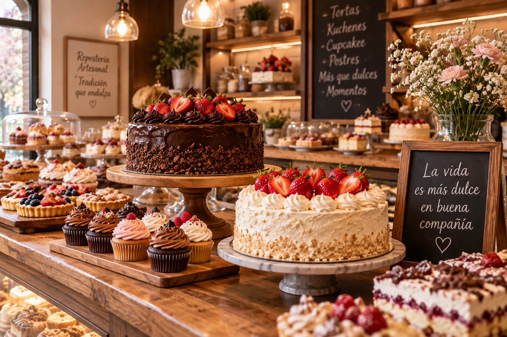

# 🍰 Pastelería Mil Sabores

<figure>

<figcaption aria-hidden="true">Pastelería Mil Sabores</figcaption>
</figure>

> Sitio web para una tienda online de pastelería, desarrollado como
> parte de la **Evaluación Parcial N.º 1 de Desarrollo FullStack II
> (DSY1104)** en Duoc UC.

------------------------------------------------------------------------

## 📌 Descripción del proyecto

**Pastelería Mil Sabores** es una aplicación web frontend orientada a
una pastelería y tienda online. El proyecto busca entregar una
experiencia clara, atractiva y funcional para que los usuarios puedan
conocer la marca, revisar productos, utilizar formularios y acceder a
distintas funcionalidades del sitio.

Esta primera etapa se centra en construir las bases de la aplicación
utilizando:

- **HTML5** para la estructura y semántica.
- **CSS3** para el diseño y la presentación visual.
- **JavaScript** para la interacción, validaciones y funcionalidades
  dinámicas.
- **Bootstrap 5** como apoyo para el diseño responsive y componentes de
  interfaz.
- **Git y GitHub** para el control de versiones y trabajo colaborativo.

El proyecto se encuentra en desarrollo, por lo que algunas
funcionalidades pueden estar pendientes de implementación o ajuste. Este
README se mantendrá actualizado a medida que avance el proyecto.

------------------------------------------------------------------------

## 🎯 Objetivos

### Objetivo general

Desarrollar una aplicación web frontend para **Pastelería Mil Sabores**,
aplicando buenas prácticas de HTML5, CSS y JavaScript, junto con un
flujo de trabajo colaborativo mediante Git y GitHub.

### Objetivos específicos

- Crear una estructura web semántica y organizada.
- Implementar navegación entre las distintas páginas del sitio.
- Diseñar una interfaz visual consistente y responsive.
- Incorporar imágenes y contenido propio de la pastelería.
- Implementar formularios con validaciones mediante JavaScript.
- Crear funcionalidades de usuario como registro, inicio de sesión y
  carrito.
- Incorporar un área administrativa para la gestión del contenido.
- Mantener el proyecto versionado mediante GitHub.
- Distribuir tareas entre los integrantes del equipo y registrar los
  cambios mediante commits.

------------------------------------------------------------------------

## 🛠️ Tecnologías utilizadas

| Tecnología      | Uso                                |
|-----------------|------------------------------------|
| HTML5           | Estructura y contenido semántico   |
| CSS3            | Estilos y diseño personalizado     |
| JavaScript      | Lógica, validaciones e interacción |
| Bootstrap 5.3.3 | Componentes y diseño responsive    |
| Google Fonts    | Tipografías del sitio              |
| Git             | Control de versiones               |
| GitHub          | Repositorio remoto y colaboración  |

------------------------------------------------------------------------

## 📂 Estructura del proyecto

``` text
PasteleriaMilSabores/
│
├── index.html
├── productos.html
├── detalle-producto.html
├── carrito-vista.html
├── login.html
├── registro.html
├── contacto.html
├── nosotros.html
├── blogs.html
├── detalle-blog1.html
├── detalle-blog2.html
│
├── admin-home.html
├── admin-productos.html
├── admin-usuarios.html
│
└── assets/
    ├── css/
    │   └── estilos.css
    │
    ├── img/
    │   ├── banner-carrito.jpg
    │   ├── banner-contacto.jpg
    │   ├── cupcake.jpg
    │   ├── historia.jpg
    │   ├── ingredientes.jpg
    │   ├── torta-chocolate.jpg
    │   ├── torta-frutas.jpg
    │   ├── torta-manjar.jpg
    │   └── vitrina.jpg
    │
    └── js/
        ├── admin-productos.js
        ├── admin-usuarios.js
        ├── app.js
        ├── carrito.js
        ├── contacto.js
        ├── detalle-producto.js
        ├── form-utils.js
        ├── login.js
        ├── menu.js
        ├── productos.js
        ├── registro.js
        └── resenas.js
```

------------------------------------------------------------------------

## 🖥️ Páginas principales

### 🏠 Inicio

`index.html`

Página principal de la aplicación. Presenta la identidad de Pastelería
Mil Sabores, contenido destacado y acceso a las principales secciones
del sitio.

### 🧁 Productos

`productos.html`

Catálogo de productos de la pastelería, con categorías y elementos
interactivos para facilitar la navegación.

### 🍰 Detalle de producto

`detalle-producto.html`

Vista destinada a mostrar información específica de un producto
seleccionado.

### 🛒 Carrito

`carrito-vista.html`

Vista destinada a revisar los productos seleccionados, subtotal,
descuentos y total de la compra.

### 👤 Inicio de sesión

`login.html`

Formulario destinado al acceso de usuarios registrados y,
posteriormente, a los distintos modos de acceso definidos para la
aplicación.

### 📝 Registro

`registro.html`

Formulario para crear una cuenta de usuario, incorporando datos
personales, contacto y selección de región/comuna.

### 📩 Contacto

`contacto.html`

Formulario de contacto para que los visitantes puedan enviar consultas a
la pastelería.

### ℹ️ Nosotros

`nosotros.html`

Sección informativa sobre la pastelería, su historia y propuesta.

### 📰 Blog

`blogs.html`

Listado de publicaciones relacionadas con la pastelería.

### 📖 Detalle de blogs

- `detalle-blog1.html`
- `detalle-blog2.html`

Páginas destinadas a mostrar el contenido completo de publicaciones
individuales.

------------------------------------------------------------------------

## 🔐 Área administrativa

El proyecto contempla un área administrativa independiente del contenido
público.

Actualmente se consideran las siguientes vistas:

- `admin-home.html`
- `admin-productos.html`
- `admin-usuarios.html`

### Funcionalidades previstas

- Acceso mediante modo administrador.
- Gestión de productos.
- Visualización y gestión de usuarios.
- Control de stock.
- Identificación de stock crítico.
- Formularios para crear y modificar productos.

> **Estado:** esta sección continúa en desarrollo. La lógica de acceso y
> algunas funcionalidades se terminarán durante la implementación de la
> aplicación.

------------------------------------------------------------------------

## 👥 Modo usuario

El proyecto contempla un flujo de usuario orientado a la compra y
navegación por la tienda.

### Funcionalidades

- Registro de usuario.
- Inicio de sesión.
- Navegación por productos.
- Visualización del detalle de productos.
- Agregar productos al carrito.
- Revisión del carrito.
- Uso de formularios de contacto.
- Interacción con reseñas cuando corresponda.

> **Estado:** funcionalidad en desarrollo y pendiente de integración
> completa entre las distintas páginas.

------------------------------------------------------------------------

## 🧾 Formularios y validaciones

Uno de los objetivos principales de esta evaluación es implementar
validaciones controladas mediante JavaScript.

Entre las validaciones contempladas se encuentran:

- Campos obligatorios.
- Formato de correo electrónico.
- Longitud mínima y máxima de campos.
- Validación de contraseña.
- Validación de RUN chileno.
- Validación de valores numéricos.
- Validación de stock y stock crítico.
- Mensajes de error personalizados.
- Sugerencias para orientar al usuario.

La lógica común de validación se encuentra centralizada principalmente
en:

``` text
assets/js/form-utils.js
```

Los formularios utilizan además atributos HTML como `required`,
`minlength`, `maxlength`, `type="email"` y otros mecanismos nativos que
complementan la validación realizada mediante JavaScript.

------------------------------------------------------------------------

## 🎨 Diseño y estilos

El proyecto utiliza una hoja de estilos externa:

``` text
assets/css/estilos.css
```

Esto permite mantener una identidad visual consistente entre las
diferentes páginas y facilita el mantenimiento del proyecto.

La interfaz está orientada a una estética relacionada con una
pastelería, utilizando:

- Tonalidades cálidas.
- Tarjetas de productos.
- Botones personalizados.
- Imágenes propias del proyecto.
- Tipografías externas.
- Diseño responsive.
- Componentes de Bootstrap.

------------------------------------------------------------------------

## 🖼️ Recursos gráficos

Las imágenes utilizadas por el proyecto se encuentran dentro de:

``` text
assets/img/
```

Entre los recursos disponibles se incluyen imágenes de:

- Tortas de chocolate.
- Tortas de frutas.
- Tortas de manjar.
- Cupcakes.
- Vitrina de productos.
- Historia de la pastelería.
- Ingredientes.
- Banners para distintas secciones.

El uso de recursos locales permite mantener el proyecto independiente de
servicios externos para sus imágenes principales.

------------------------------------------------------------------------

## ⚙️ JavaScript

La lógica del proyecto se divide en archivos según la funcionalidad
correspondiente.

| Archivo               | Responsabilidad                              |
|-----------------------|----------------------------------------------|
| `app.js`              | Datos y funciones generales de la aplicación |
| `productos.js`        | Renderizado y filtrado de productos          |
| `detalle-producto.js` | Información del producto seleccionado        |
| `carrito.js`          | Gestión del carrito                          |
| `login.js`            | Inicio de sesión                             |
| `registro.js`         | Registro de usuarios                         |
| `form-utils.js`       | Validaciones y utilidades de formularios     |
| `contacto.js`         | Formulario de contacto                       |
| `menu.js`             | Funcionalidades del menú                     |
| `resenas.js`          | Gestión de reseñas                           |
| `admin-productos.js`  | Gestión administrativa de productos          |
| `admin-usuarios.js`   | Gestión administrativa de usuarios           |

------------------------------------------------------------------------

## 💾 Persistencia frontend

Durante esta etapa, algunas funcionalidades se implementarán utilizando
almacenamiento del navegador, principalmente mediante:

- `localStorage`
- `sessionStorage`

Esto permite simular persistencia de información y mantener determinados
datos entre páginas sin utilizar todavía un backend.

> Esta implementación corresponde al alcance frontend de la evaluación y
> podrá evolucionar en etapas posteriores del proyecto.

------------------------------------------------------------------------

## 📱 Diseño responsive

La aplicación está pensada para adaptarse a diferentes tamaños de
pantalla mediante:

- Bootstrap.
- Clases responsive.
- Flexbox y Grid cuando corresponde.
- Contenedores fluidos.
- Imágenes adaptables.
- Distribución responsive de tarjetas y elementos de navegación.

------------------------------------------------------------------------

## 🔗 Navegación

Las páginas del proyecto se encuentran conectadas mediante hipervínculos
internos.

El objetivo es que el usuario pueda desplazarse de forma coherente
entre:

``` text
Inicio
  ↓
Productos
  ↓
Detalle de producto
  ↓
Carrito

Inicio
  ↓
Nosotros
  ↓
Blog
  ↓
Detalle del blog

Inicio
  ↓
Registro
  ↓
Login
```

Además, el área administrativa posee sus propias vistas y navegación.

------------------------------------------------------------------------

## 🧪 Estado actual del proyecto

| Funcionalidad            | Estado |
|--------------------------|:------:|
| Estructura HTML5         |   🟢   |
| Navegación entre páginas |   🟢   |
| CSS externo              |   🟢   |
| Diseño responsive        |   🟢   |
| Imágenes locales         |   🟢   |
| Catálogo de productos    |   🟡   |
| Detalle de producto      |   🟡   |
| Carrito                  |   🟡   |
| Registro                 |   🟡   |
| Inicio de sesión         |   🟡   |
| Validaciones JavaScript  |   🟡   |
| Contacto                 |   🟡   |
| Reseñas                  |   🟡   |
| Modo usuario             |   🟡   |
| Modo administrador       |   🟡   |
| Gestión de productos     |   🟡   |
| Gestión de usuarios      |   🟡   |
| GitHub / colaboración    |   🟢   |
| Documentación README     |   🟢   |

**Leyenda:**

- 🟢 Implementado / disponible.
- 🟡 En desarrollo o pendiente de integración.
- 🔴 No implementado.

------------------------------------------------------------------------

## 📋 Relación con la Evaluación Parcial 1

El proyecto se desarrolla considerando los indicadores establecidos para
**DSY1104 Desarrollo FullStack II**.

### IE1.1.1 — HTML y contenido web

Se trabaja con:

- Estructura HTML5.
- Elementos semánticos.
- Hipervínculos.
- Imágenes.
- Botones.
- Elementos de navegación.
- Formularios.
- Footer.
- Contenido multimedia cuando corresponda al alcance final.

### IE1.1.2 — CSS personalizado

Se utiliza una hoja CSS externa para mantener los estilos separados del
HTML y facilitar el mantenimiento.

### IE1.2.1 — Validaciones JavaScript

Se implementan validaciones mediante JavaScript, junto con sugerencias y
mensajes de error personalizados.

### IE1.3.1 — Repositorio colaborativo

El proyecto se mantiene en un repositorio remoto y se trabaja mediante
cambios registrados y distribuidos entre los integrantes.

### IE1.1.3 — Explicación de HTML

Durante la presentación se explicará el uso de HTML5 y la importancia de
utilizar una estructura semántica correcta.

### IE1.1.4 — Explicación de CSS

Se explicará cómo los estilos externos permiten construir una interfaz
consistente y facilitan el mantenimiento.

### IE1.2.2 — Demostración de JavaScript

Durante la presentación se demostrará el funcionamiento de las
validaciones, sugerencias y mensajes personalizados.

### IE1.3.2 — Justificación del trabajo colaborativo

Se explicará la importancia de utilizar GitHub, mantener commits
coherentes y distribuir las tareas dentro del equipo.

------------------------------------------------------------------------

## 👨‍💻 Equipo de desarrollo

**Pastelería Mil Sabores** fue desarrollada por:

- **Martín Lara**
- **Martín Reyes**
- **Diego Adán**

El trabajo se distribuye entre los integrantes y los cambios se integran
al repositorio del proyecto.

------------------------------------------------------------------------

## 🌿 Flujo de trabajo con Git

El proyecto utiliza Git para controlar las versiones del código.

Flujo general:

``` text
Crear / modificar funcionalidad
        ↓
Probar cambios
        ↓
git add
        ↓
git commit
        ↓
git push
        ↓
Repositorio GitHub
        ↓
Integración de cambios
```

Se busca utilizar mensajes de commit claros y relacionados directamente
con el cambio realizado.

Ejemplos:

``` text
feat: agregar validaciones al formulario de registro
fix: corregir navegación del catálogo
style: mejorar diseño de tarjetas de productos
feat: implementar carrito de compras
docs: actualizar README
```

------------------------------------------------------------------------

## 🚀 Instalación y ejecución

Este proyecto corresponde actualmente a un frontend estático, por lo que
no requiere instalar un servidor backend para visualizar sus páginas.

### 1. Clonar el repositorio

``` bash
git clone https://github.com/LBV00/TrabajoFullstack1-barbershop.git
```

### 2. Ingresar a la carpeta

``` bash
cd PasteleriaMilSabores
```

### 3. Ejecutar el proyecto

Abrir:

``` text
index.html
```

También se recomienda utilizar **Visual Studio Code** junto con una
extensión como **Live Server** para ejecutar el proyecto durante el
desarrollo.

------------------------------------------------------------------------

## 🔮 Próximas mejoras

El proyecto continuará evolucionando después de esta primera entrega.

Entre las mejoras planificadas se encuentran:

- Finalizar el modo usuario.
- Finalizar el modo administrador.
- Integrar completamente el inicio de sesión con los roles definidos.
- Completar el CRUD de productos.
- Completar la gestión de usuarios.
- Mejorar la persistencia de datos.
- Completar las validaciones pendientes.
- Revisar la navegación de todas las páginas.
- Agregar y organizar productos definitivos.
- Completar y revisar el contenido del blog.
- Realizar pruebas generales antes de la presentación.
- Mantener actualizada la documentación.

------------------------------------------------------------------------

## 📚 Contexto académico

**Asignatura:** Desarrollo FullStack II  
**Sigla:** DSY1104  
**Evaluación:** Evaluación Parcial N.º 1  
**Modalidad:** Entrega de encargo + presentación  
**Proyecto:** Pastelería Mil Sabores

La evaluación contempla una entrega grupal y una presentación
individual. Por este motivo, además del funcionamiento del proyecto,
cada integrante debe ser capaz de explicar las decisiones tomadas
durante el desarrollo.

------------------------------------------------------------------------

## 📄 Documentación

Documentos asociados al proyecto:

- Especificación de Requisitos del Software (ERS).
- Planilla de requerimientos.
- Material de la Evaluación Parcial N.º 1.
- Presentación del proyecto.
- README del proyecto.

------------------------------------------------------------------------

## 📌 Nota de desarrollo

Este proyecto se encuentra **activo y en desarrollo**. La documentación
describe tanto las funcionalidades implementadas como aquellas
planificadas para completar la aplicación.

El objetivo es mantener este README actualizado junto con la evolución
del proyecto, de manera que sirva como documentación técnica, guía de
instalación y presentación general del sistema.

------------------------------------------------------------------------

## 📜 Licencia

Proyecto académico desarrollado para **Duoc UC**.

Uso destinado a fines educativos y de evaluación.
